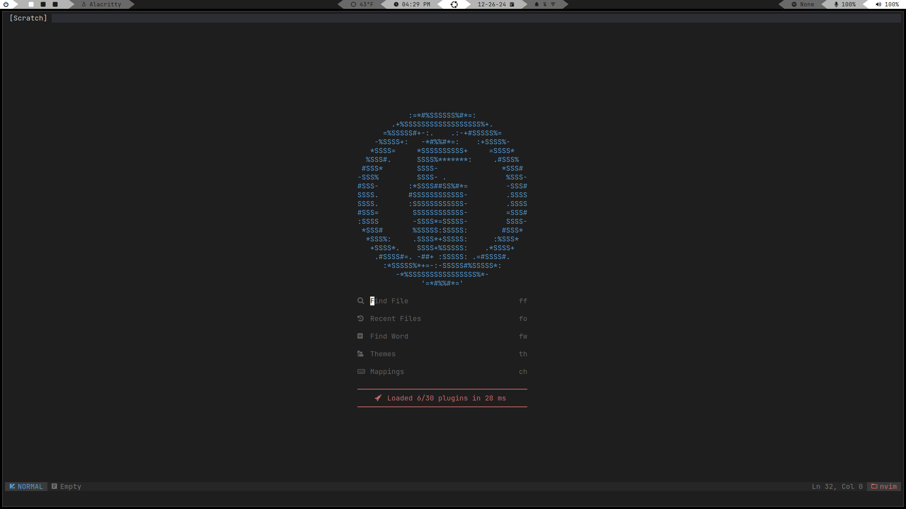

# neovim config

Configuration files for my personal neovim configuration (based on NvChad).



## dependencies
- nvim
- npm
- yarn

## install
1. ```git clone https://github.com/hunterwellis/nvim-config ~/.config/nvim && nvim```
<<<<<<< HEAD
2. ```:Lazy sync```
3. ```:MasonInstallAll```
=======
2. ```:MasonInstallAll```
3. ```:Lazy sync```
>>>>>>> acb6d42c469d3e0178e05b9c81066dce9321eea8

