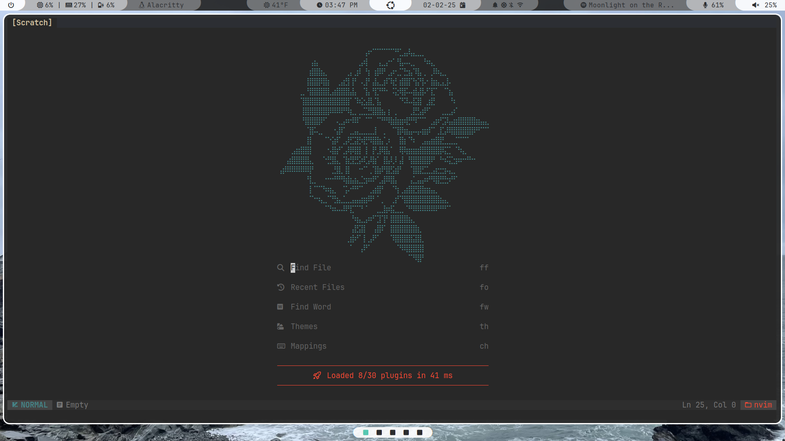

# neovim config

Config files for my personal neovim configuration (based on NvChad).



## dependencies
- nvim
- npm
- yarn

## install
1. clone into ```~/.config/nvim```
2. run ```:MasonInstallAll```
3. run ```:Lazy sync```

